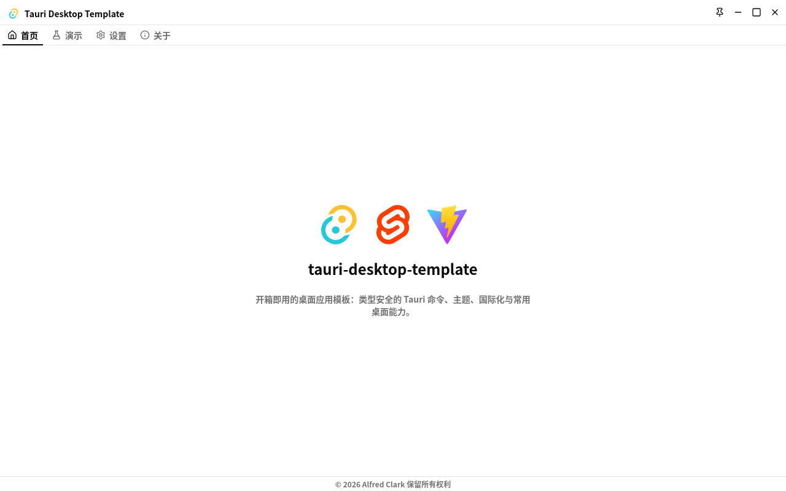
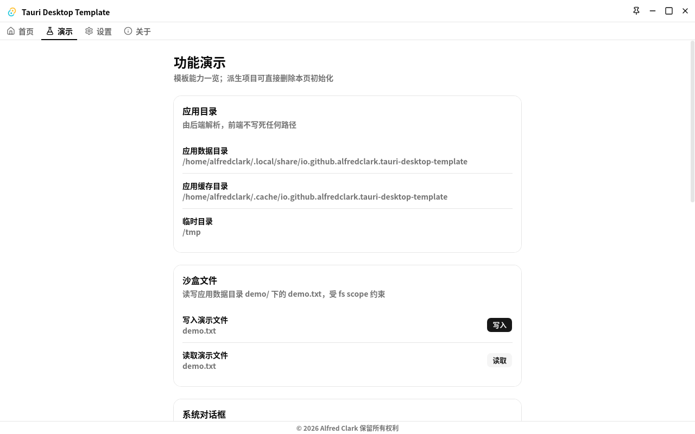
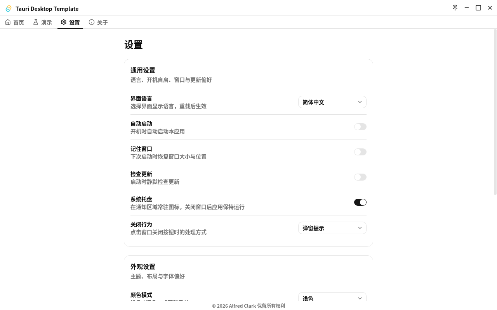
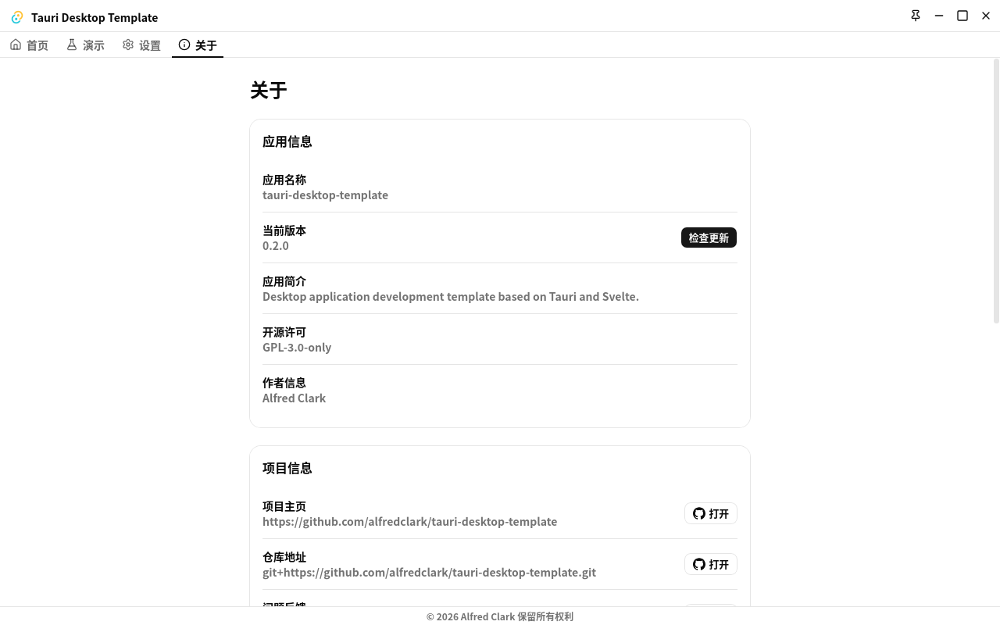

[English](../README.md) | 简体中文

# tauri-desktop-template

基于 Tauri v2 + SvelteKit 2 + Svelte 5 的桌面应用程序开发模板。

开箱即用的生产级起点：类型安全的 Tauri 命令链、主题、前后端国际化、崩溃兜底与常用桌面能力。

## 应用截图

| 首页 (`/`)                     | 演示页 (`/demo`)            |
| ------------------------------ | --------------------------- |
|        |   |
| 设置页 (`/settings`)           | 关于页 (`/about`)           |
|  |  |

> 截图存放于 `docs/images/`，以路由名命名（`home`、`demo`、`settings`、`about`）。

## 功能特性

1. **类型安全命令链（tauri-specta）** — Rust 侧 `#[tauri::command]` +
   `#[specta::specta]` 导出类型到 `src/libs/commands/bindings.ts`（生成物，禁止手改）。
   前端一律走 `src/libs/commands` 链式 API，组件内禁止裸 `invoke`：
   - 带回落取值：`commands.greet(name).value("Default")`
   - 按状态分支：`commands.greet(name).result()`
   - 事务写法：`commands.updateConfig({ locale }).success(onOk).failed(onFail)`
   - 未注册 `.failed()` 的失败会自动经 `plugin-log` 上报，不会静默丢失。
2. **明暗主题 + 配色主题** — `mode-watcher` 跟随系统（`light` / `dark` / `system`），Tailwind
   v4 `.dark` 变体；十种配色（鲜艳系 `ocean` / `teal` / `emerald` / `amber` / `tangerine` /
   `rose` / `amethyst` + 暗色美学 `nord` / `dracula` / `tokyo-night`，`neutral` 回落默认值）
   经 `data-color-theme` 属性切换（见 `themes.css`，刻意避开 mode-watcher 挂载即覆盖的
   `data-theme`）。纯前端偏好，持久化于 `localStorage`，首帧前生效。
3. **前后端双轨国际化（Paraglide + rust-i18n）** — 前端 `paraglide-js`（`en` / `zh-CN`），后端
   `rust-i18n`（`src-tauri/locales/*.yml`，`fallback = "en"`）。唯一持久化点是后端
   `config.json` 的 `locale` 键：后端先读持久化值、缺失则经 `tauri-plugin-os` 探测系统语言并
   落库；前端在 `+layout.ts` 的 `load()` 中首帧前水合并用
   `setLocale(locale, { reload: false })` 对齐。
4. **前后端崩溃兜底** — 前端 `ErrorBoundary`（经 `@tauri-apps/plugin-log` 上报，堆栈仅 dev
   显示，2s 节流）；后端 `cores/system.rs` panic 钩子（先走常规日志，日志不可用时落盘到
   `%TEMP%/my_app_crash.log`，超 512KB 轮转保留一份）。
5. **桌面能力演示页（`/demo`）** — 每插件一卡片分组 + 文件拖放分组，删页即初始化（流程见下文“移除演示页”）：
   - 应用目录（后端解析 `appData` / `appCache` / `temp`，前端无硬编码路径）
   - 沙盒文件（`$APPDATA/demo/*` 域约束 + 后端路径收敛校验）
   - 文件拖放（窗口拖放事件，后端鉴别元信息并可存入沙盒）
   - 系统对话框（异步回调版文件 / 目录 / 保存框，取消返回 `None`）
   - 纯文本剪贴板（跨桥前先做长度校验的读写）
   - 本地通知（由后端发送）
   - 全局快捷键（固定演示键，仅桌面端）
6. **设置页（`/settings`）** — 通用分组（语言、开机自启、记住窗口、自动检查更新、托盘、
   关闭行为 `prompt` / `exit` / `minimize_to_tray`）经 `updateConfig` 落盘后端
   `config.json`；外观分组（主题、配色、`tabs` / `sidebar` 布局、系统字体选择器、字重、
   字号）纯前端；一键恢复默认。
7. **关于页（`/about`）** — 应用信息、项目链接（`opener`，仅放行 `http(s)`）、平台信息、
   诊断分组（打开日志 / 配置目录、复制系统信息）与更新面板（检查 → 带进度下载 → 重启，
   仅桌面端，检查 120s 超时兜底）。
8. **桌面外壳** — 无边框窗口 + 自绘标题栏（置顶 / 最小化 / 最大化 / 关闭）、带本地化菜单
   （显示/隐藏、退出）的系统托盘、关闭行为拦截、开机自启、窗口状态记忆（窗口初始
   `visible: false`，恢复后统一 `show`）、单实例聚焦 + 深链参数转发（`tdt://` 协议）、更新
   对接 GitHub Releases `latest.json`。

## 技术选型

> 版本唯一来源是 `package.json`（前端）与 `src-tauri/Cargo.toml`（后端），按其中声明的版本
> 使用 API，禁止自行升级 / 降级。

| 层级        | 技术选型                                                                                                                                                                                                     | 说明                                                                                                    |
| ----------- | ------------------------------------------------------------------------------------------------------------------------------------------------------------------------------------------------------------ | ------------------------------------------------------------------------------------------------------- |
| 前端框架    | SvelteKit 2 + Svelte 5                                                                                                                                                                                       | SPA 模式（`adapter-static` + `fallback: index.html`，`ssr = false`），Vite 端口 1420                    |
| UI / 样式   | shadcn-svelte（nova / neutral）+ Tailwind CSS v4，Lucide 图标，Geist 字体                                                                                                                                    | `cn()` 合并类名，`.dark` 变体 + `[data-color-theme]` 配色                                               |
| 前端插件    | `@tauri-apps/api`、`plugin-log` / `opener` / `updater`、`system-fonts`                                                                                                                                       | 日志经 `plugin-log` 上报，字体列表经 `system-fonts-api`                                                 |
| 前后端契约  | tauri-specta + `specta` / `specta-typescript`                                                                                                                                                                | 生成物 `src/libs/commands/bindings.ts`，禁止手改                                                        |
| 国际化      | Paraglide（前端）+ rust-i18n（后端）                                                                                                                                                                         | `src/libs/i18n/messages/*.json` + `src-tauri/locales/*.yml`                                             |
| 后端框架    | Tauri v2 + Rust（edition 2024，工具链由 `rust-toolchain.toml` 锁定）                                                                                                                                         | `commands/` 薄封装，`features/` 纯逻辑，`cores/` 跨层共享能力                                           |
| 后端插件    | `opener` / `store` / `log` / `os` / `updater` / `autostart` / `window-state` / `system-fonts` / `single-instance` / `deep-link` / `fs` / `dialog` / `clipboard-manager` / `notification` / `global-shortcut` | `updater` / `autostart` / `window-state` / `single-instance` / `deep-link` / `global-shortcut` 仅桌面端 |
| 构建 / 质量 | TypeScript 严格模式 + `svelte-check`，ESLint + Prettier，vitest，pnpm                                                                                                                                        | Node `>= 24`，`pnpm-lock.yaml` 与 `Cargo.lock` 均需提交                                                 |
| 部署        | GitHub Actions（`ci.yml` / `release.yml`）+ Tauri bundler                                                                                                                                                    | 三处版本号联动（见下文）                                                                                |

## 快速开始

环境要求：Node `>= 24`、`pnpm@12.6.0`、Rust 工具链以 `rust-toolchain.toml` 为准。

```bash
pnpm install --frozen-lockfile   # 按锁文件安装（不要用 npm / yarn）

pnpm tauri:dev                   # 完整桌面联调：Vite（端口 1420）+ Tauri 窗口
pnpm dev                         # 仅启动前端（Tauri 命令不可用时自动降级）

pnpm format                      # 自动修复两端：Prettier + ESLint + cargo fmt
pnpm validate                    # test + lint + check（每次修改后必跑）

pnpm build                       # 仅构建前端（adapter-static 输出到 build/）
pnpm tauri:build                 # 完整打包；tauri:build:local 仅编译不打包
```

常用脚本：

```bash
pnpm lint            # 前端 + 后端全量检查
pnpm check           # svelte-kit sync + svelte-check（严格 TS 检查）
pnpm test            # vitest + cargo test 单次运行
pnpm test:cargo      # 后端测试 + 重生成 bindings.ts
pnpm i18n:compile    # 改完 messages/ 后必须执行
pnpm tauri:icon      # 由 static/icon.png 生成各平台图标
pnpm release         # bumpp 联动三处版本：package.json + tauri.conf.json + Cargo.toml
```

## 页面一览

| 路由        | 截图                       | 内容说明                                                                        |
| ----------- | -------------------------- | ------------------------------------------------------------------------------- |
| `/`         | `docs/images/home.png`     | 首页英雄区：技术栈图标 + 应用名 + 简介；布局骨架验证起点，业务在此开发。        |
| `/demo`     | `docs/images/demo.png`     | 六插件分组卡片（目录 / 沙盒文件 / 对话框 / 剪贴板 / 通知 / 快捷键）+ 文件拖放。 |
| `/settings` | `docs/images/settings.png` | 通用（后端持久化）+ 外观（纯前端）两分组 + 恢复默认按钮。                       |
| `/about`    | `docs/images/about.png`    | 应用 / 项目 / 平台 / 诊断四分组 + 更新面板。                                    |

导航标签在 `src/libs/navigation/nav-tabs.ts` 一处注册，供 `tabs` 与 `sidebar` 两套布局
（`src/components/layout/`）同源使用；新增页面只需加一项。外观（布局注册表 + 字体偏好）
位于 `src/libs/hooks/appearance.svelte.ts`。

## 配置说明

后端 `config.json`（经 `tauri-plugin-store`，逻辑在 `cores/config.rs`）保存 durable 配置：

- `locale`（specta 导出的 `"en" | "zh-CN"` 联合类型，禁止裸 `string`）、`auto_start`、
  `remember_window`、`auto_check_update`、`tray_enabled`、
  `close_behavior`（`prompt` / `exit` / `minimize_to_tray`）、`schema_version`。
- 写路径只走 `update` / `save_locale` / `migrate` 三入口，`update` 内幂等 `migrate`。
  新增 / 变更配置项时，若改动已有字段语义须同步 `CURRENT_SCHEMA_VERSION` 与 `MIGRATIONS`
  迁移链。
- 纯前端外观偏好（主题、配色、布局、字体 / 字重 / 字号）只存 `localStorage`，不走命令链，
  是有意例外。

## 特殊流程

**新增 / 修改命令：** `features/<name>.rs` 实现业务（在 `features/mod.rs` 声明
`pub mod <name>;`）→ `commands/<name>.rs` 薄封装（`CommandResult` + 双注解 +
`collect_commands!`）→ `cargo test` 重生成 `bindings.ts` → 前端链式 API 调用 → 联调。
禁止手改 `bindings.ts`、禁止跳过重生成直接改前端。

**改文案：** 前端改 `src/libs/i18n/messages/*.json` → `pnpm i18n:compile` → 用 `m.<键>()` 取值、
`setLocale()` 切换；后端改 `src-tauri/locales/*.yml` → `rust_i18n::t!(...)` 取值。

**移除演示页**（派生项目初始化清单，新项目先走 `AGENTS.md` 第 10 章第 8 条改名再删，`greet` 最小契约示例保留）：删目录
`src/routes/(main)/demo/`、`src/components/widget/demo/`、`cores/demo.rs`、
`plugins/{fs,dialog,notification,global_shortcut}.rs`（`clipboard` 保留：about 页依赖写剪贴板）；删 `nav-tabs.ts` 的 `/demo`
项；删全部 `demo_` 开头文案键 → `i18n:compile`；瘦身 `features/demo.rs` 与
`commands/demo.rs`（保留 `greet`）并同步 `collect_commands!`；在 `plugins/mod.rs` 与 `lib.rs`
摘注册、裁 `capabilities/plugins.json`、删四个演示插件依赖（`clipboard-manager` 保留）；`cargo test` → `pnpm format` +
`pnpm validate`。完整清单见 `AGENTS.md` 第 10 章第 6 条。

## 项目结构（精简）

```text
src/routes/(main)/         # /、/demo、/settings、/about 页面（分组独享布局）
src/components/widget/    # settings/、about/、demo/ 页面小组件
src/components/layout/    # tabs / sidebar 布局壳 + 标题栏 / 导航部件
src/libs/commands/        # bindings.ts（生成物）+ 链式 API 封装
src/libs/i18n/            # messages/ 文案 + project.inlang/ 配置
src/libs/navigation/      # nav-tabs.ts 导航单源注册表
src-tauri/src/commands/   # 薄封装 + collect_commands! 注册
src-tauri/src/features/   # 纯业务逻辑（不依赖 Tauri 运行时）
src-tauri/src/cores/      # config / locale / system / tray / updater 等共享能力
src-tauri/src/plugins/    # 各插件初始化
```

分层、边界与完整结构见 `AGENTS.md`。

## 验证与贡献

- 任何改动完成后先 `pnpm format` 再 `pnpm validate`，全绿前不得宣称完成、不得提交。
  改后端命令需另确认 `bindings.ts` 有同步 diff；改文案需补跑 `pnpm i18n:compile`。
- 提交遵循 Conventional Commits、英文小写（例：`feat(i18n): persist locale in backend`），
  一次提交只做一件事；由开发者手动提交，不自动提交。
- 发版：提 PR → CI 全绿 → Code Review → Squash 合并 → `pnpm release` 联动三处版本号
  （`package.json` + `src-tauri/tauri.conf.json` + `src-tauri/Cargo.toml`）→ 打 tag `vX.Y.Z`
  → `release.yml` 自动打包 → `pnpm changelog` 生成日志。

## 开源协议

GPL-3.0-only，见 [LICENSE](../LICENSE)。
